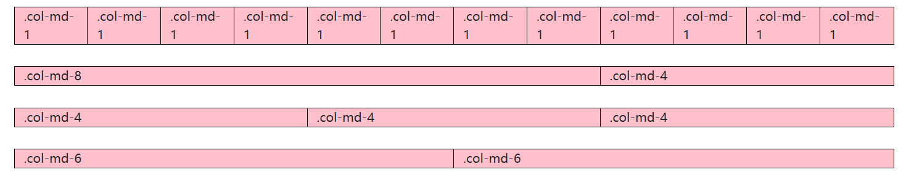
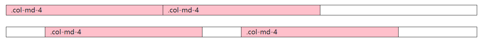
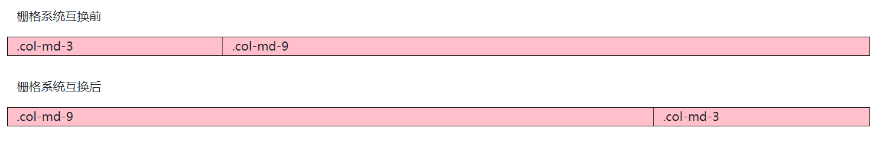
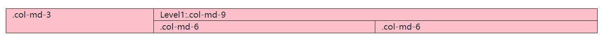
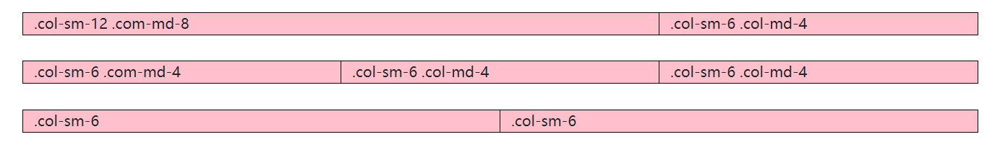
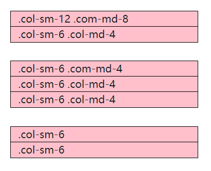

# Bootstrap&Jquery

## 介绍
2022上学期Bootstrap&jQuery练习作品

## 软件架构
使用Bootstrap&Jquery

## 使用说明
请根据自己的Bootstrap和Jquery版本修改相应代码

##相关笔记

## 使用栅格系统



- 实现代码
  ```HTML
  <div class="container">
      <div class="row">
          <div class="col-md-1">.col-md-1</div>
          <div class="col-md-1">.col-md-1</div>
          <div class="col-md-1">.col-md-1</div>
          <div class="col-md-1">.col-md-1</div>
          <div class="col-md-1">.col-md-1</div>
          <div class="col-md-1">.col-md-1</div>
          <div class="col-md-1">.col-md-1</div>
          <div class="col-md-1">.col-md-1</div>
          <div class="col-md-1">.col-md-1</div>
          <div class="col-md-1">.col-md-1</div>
          <div class="col-md-1">.col-md-1</div>
          <div class="col-md-1">.col-md-1</div>
      </div>
      <div class="row">
          <div class="col-md-8">.col-md-8</div>
          <div class="col-md-4">.col-md-4</div>
      </div>
      <div class="row">
          <div class="col-md-4">.col-md-4</div>
          <div class="col-md-4">.col-md-4</div>
          <div class="col-md-4">.col-md-4</div>
      </div>
      <div class="row">
          <div class="col-md-6">.col-md-6</div>
          <div class="col-md-6">.col-md-6</div>
      </div>
  
  ```


Bootstrap内置了一套响应式、移动设备优先的流式栅格系统，随着屏幕设备或可视窗口（viewport）尺寸的增加，**系统会自动分为最多12列**。它包含了易于使用的预定义class，还有强大的mixin用于生成更具语义的布局。

栅格系统是通过定义容器的大小，平均分成若干份，**最大是12份**，也可以自己定义栅格份数，再调整内边距（padding）和外边距（margin），最后结合媒体查询，就能制作出强大的栅格系统。

伴随响应式设计的思想，需要适配4中类型的浏览器，分别是超小屏、小屏、中屏和大屏。

| |超小屏手机(<768px)|小屏幕平板(≥768px)|中等屏幕桌面显示器(≥992px)|大屏幕桌面显示器(≥1200px)|
|---|---|---|---|---|
|栅格系统行为|总是水平排列|开始是堆叠在一起的，当大于这些阈值时将变为水平排列|开始是堆叠在一起的，当大于这些阈值时将变为水平排列|开始是堆叠在一起的，当大于这些阈值时将变为水平排列|
|.container最大宽度|None（自动）|750px|970px|1170px|
|类前缀|.col-xs-|.col-sm-|.col-md-|.col-lg-|
|列(column)数|12|12|12|12|
|最大列宽|自动|~62px|~81px|~97px|
|槽(gutter)宽|30px（每列左右均有15px）|30px（每列左右均有15px）|30px（每列左右均有15px）|30px（每列左右均有15px）|
|可嵌套|是|是|是|是|
|偏移(offsets)|是|是|是|是|
|列排序|是|是|是|是|


### 如何使用？

引入Bootstrap和Jquery（必须按照顺序引入）

```HTML
<link href="css/bootstrap.css" rel="stylesheet">
<script type="text/javascript" src="js/jquery-3.6.0.js"></script>
<script type="text/javascript" src="js/bootstrap.js"></script>
```


创建框架（charset是为了防止页面乱码，viewport是为了自适应不同设备的页面）

```HTML
<meta charset="UTF-8">
<meta name="viewport" content="width=device-width,initial-scale=1.0, minimum-scale=1.0, maximum-scale=1.0, user-scalable=no"/>
```


### 栅格偏移



- 代码实现
  ```HTML
  <div class="container">
      <div class="row">
          <div class="col-md-4">.col-md-4</div>
          <div class="col-md-4">.col-md-4</div>
      </div>
  </div>
  <div class="container">
      <div class="row">
          <div class="col-md-4 offset-md-1">.col-md-4</div>
          <div class="col-md-4 offset-md-1">.col-md-4</div>
      </div>
  </div>
  ```

### 栅格互换

栅格系统5开始 push和pull已经被弃用



- 代码实现
  ```HTML
  <div class="container">
      <p>栅格系统互换后</p>
      <div class="row">
          <div class="col-md-3 order-2">
          <!--order用于排序 从左往右 order-2代表第二个-->
              .col-md-3
          </div>
          <div class="col-md-9 order-1">
          <!--order用于排序 从左往右 order-1代表第一个-->
              .col-md-9
          </div>
      </div>
  </div>
  ```


### 栅格嵌套



- 代码实现
  ```HTML
  <div class="container">
      <div class="row">
          <div class="col-md-3">.col-md-3</div>
          <div class="col-md-9">
              Level1:.col-md-9
              <div class="row">
                  <div class="col-md-6">.col-md-6</div>
                  <div class="col-md-6">.col-md-6</div>
              </div>
          </div>
      </div>
  </div>
  ```


嵌套后，也是按照**最多12列**来进行分列

### 响应式栅格





- 代码实现
  ```HTML
  <div class="container">
      <div class="row">
          <div class="col-sm-12 col-md-8">.col-sm-12 .com-md-8</div>
          <div class="col-sm-6 col-md-4">.col-sm-6 .col-md-4</div>
      </div>
      <div class="row">
          <div class="col-sm-6 col-md-4">.col-sm-6 .com-md-4</div>
          <div class="col-sm-6 col-md-4">.col-sm-6 .col-md-4</div>
          <div class="col-sm-6 col-md-4">.col-sm-6 .col-md-4</div>
      </div>
      <div class="row">
          <div class="col-sm-6">.col-sm-6</div>
          <div class="col-sm-6">.col-sm-6</div>
      </div>
  </div>
  ```


响应式栅格是为了适应不同设备做出的自适应调整


